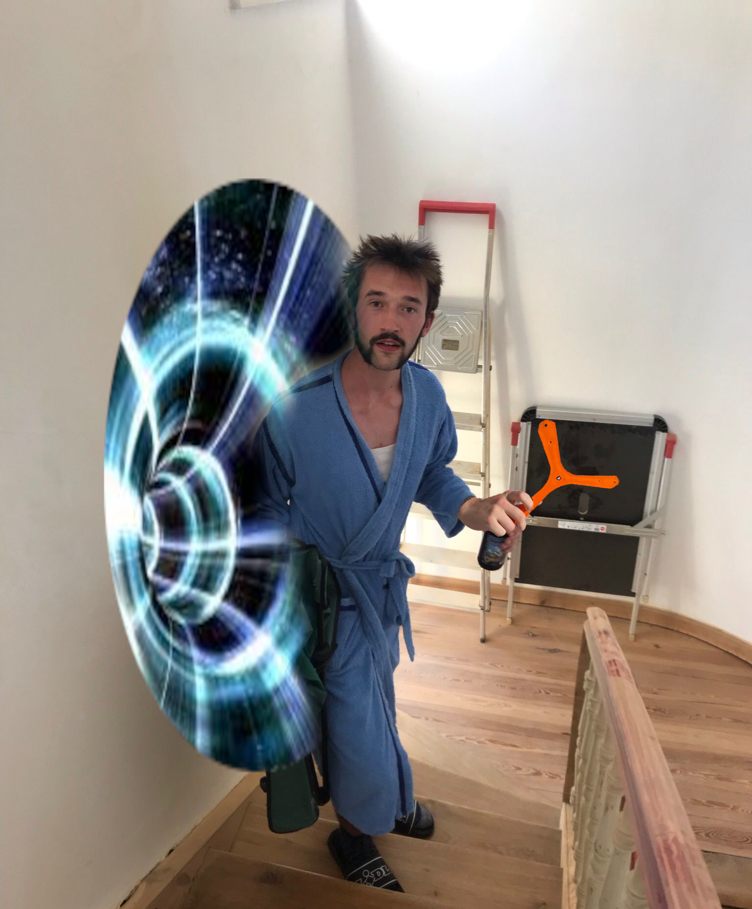
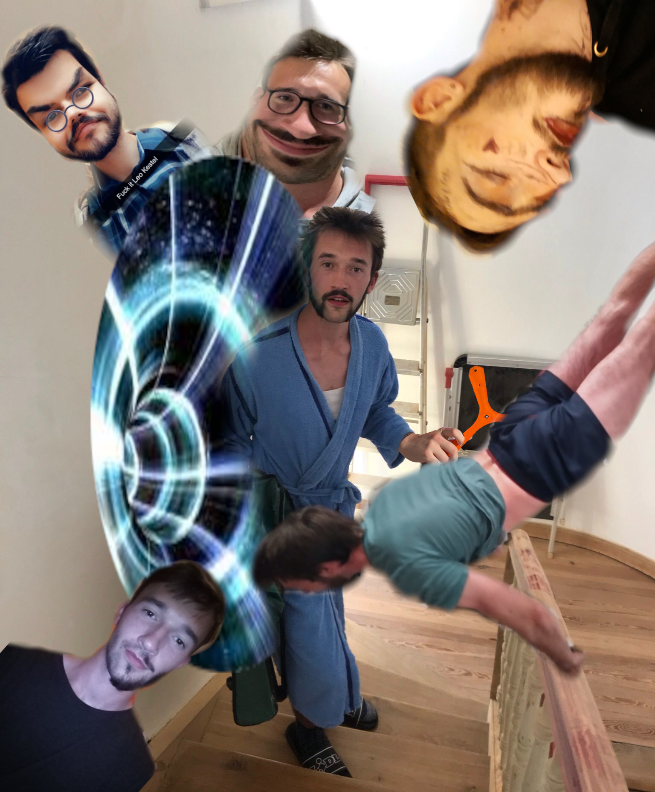

Doch plötzlich... öffnet sich ein Wurmloch vor dir. Und Leo tritt heraus. 

"Ich habs erledigt, nun können wir endlich zu Party." Er ist stolz, hölt etwas Orangenes in der Hand.

"Wie kann das sein? Du warst doch gerade noch -"

Leo unterbricht dich udn zeigt dir seinen Boomerang.

"Die ganze Welt habe ich nach ihm abgesucht. Jetzt habe ich ihn endlich wieder. In Köln lag er, warum auch immer. Meine Göste brauchen das, die Party kann steigen!"

Du bist immer noch perplex. Du hast ihn doch immer wieder gesehen. Gibt es zwei Leos? 

Auf einmal erscheinen immer mehr Leos aus dem Wurmloch.

Langsam dömmert es dir.

Die Person, die die die ganze Zeit all diese Hobbies, all die tausende von Sachen gemacht hat, war nie der selbe Mensch. Wie hötte das auch funktionieren sollen?
So vielföltige Interessen. So viel Zeitaufwand. Saufstel, Downstel, Creepstel, Queerstel, Kiffstel - sind tatsöchlich komplett verschiedene Personen aus verschiedenen Universen gewesen.

Auch wenn dich das sehr flasht, musst du eine Entscheidung treffen. Welchen all der Kestels nimmst du zur Party mit?
Welchen Kestel willst du heute erleben?

Stimme hier ab: <a href="https://www.strawpoll.me/45833771">https://www.strawpoll.me/45833771</a>

Du willst nochmal spielen? Kehre zur ersten Entscheidung zuröck:
<a href="/leonardkestel/sanmarino">
<button>San Marino</button>
</a>
<a href="/leonardkestel/eindhoven">
<button>Eindhoven</button>
</a>