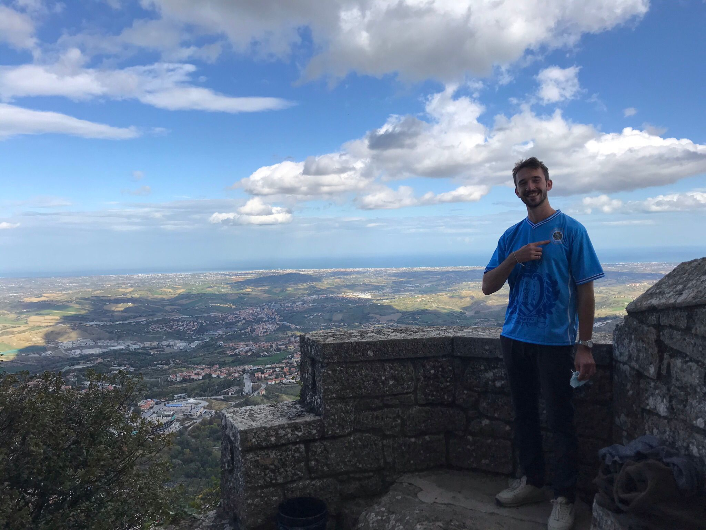

Du stehst hoch oben auf der Burg in San Marino und siehst, wie sich Kestel gerade von einem zwielichtigen Verkäufer abziehen lässt.
"Schau mal her! Neues Trikot!" ruft er die grinsend zu, während er sich das amateurhaft gefälschte Leibchen überzieht.

"Steig auf Leo, wir müssen zu deiner Feier." sagst du zu ihm.
Er erwidert aber: "Ich muss zuerst noch ein anderes Geschäft erledigen", steigt in seinen Wagen und verschwindet wieder.

Wo sucht ihr ihn als Nächstes?

<a href="/leonardkestel/tipico">
<button>Tipico</button>
</a>
<a href="/leonardkestel/wald">
<button>im Wald</button>
</a>