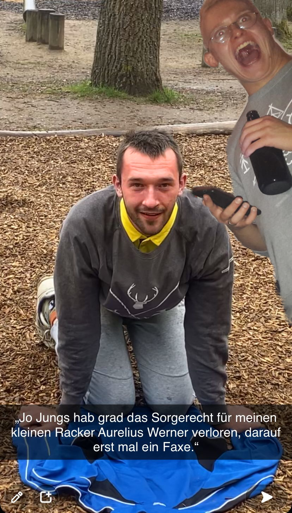

Du begibst dich in den Stangenpark und siehst, wie Leo mit Jahrlsn (das "a" ist stumm) dem Lachs abh�ngt.

Beim Kopfstand scheint ihm zu viel Blut in den Kopf geflossen zu sein. Er ist desorientiert.
Diesmal kriegst du ihn zu fassen, ganz sicher. 
Du greifst nach ihm und versuchst ihn mit dir zu ziehen.

Doch plötzlich...

<a href="/leonardkestelistweg.github.io/boomerang">
<button>plötzlich was?</button>
</a>