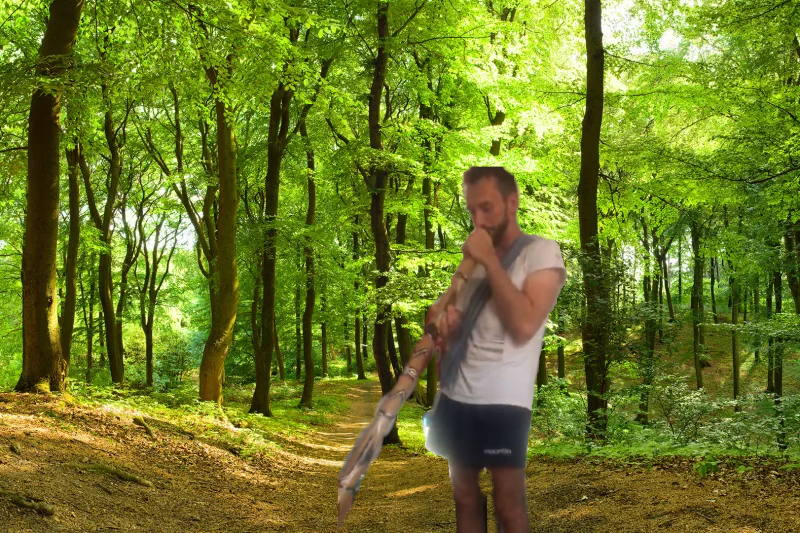

Du stehst am Waldeingang und wartest. Stolz tritt er aus den Bäumen hervor.
Und präsentiert sein frisch selbst-geschnitztes Didgeridoo

"Hör zu und spüre, wie du in Einklang mit dir selbst kommen wirst"

Bevor Leo zum Spielen ansetzt, kannst du dich gerade noch so aufs Motorrad retten.

"Warte noch, wir müssen auch das Brettspiel spielen was ich auf das Didgeridoo geschnitzt habe.", ruft er dir hinterher.

"Schnell weg hier, Vinz" - Du willst erstmal deine Ruhe vor Leo.

An welchem Ort wärdest du ihn am wenigsten erwarten?

<a href="/leonardkestel/friseur">
<button>Friseur</button>
</a>
<a href="/leonardkestel/paula">
<button>Pünktlich im Labor zu seinem Experiment-Termin mit Paula</button>
</a>