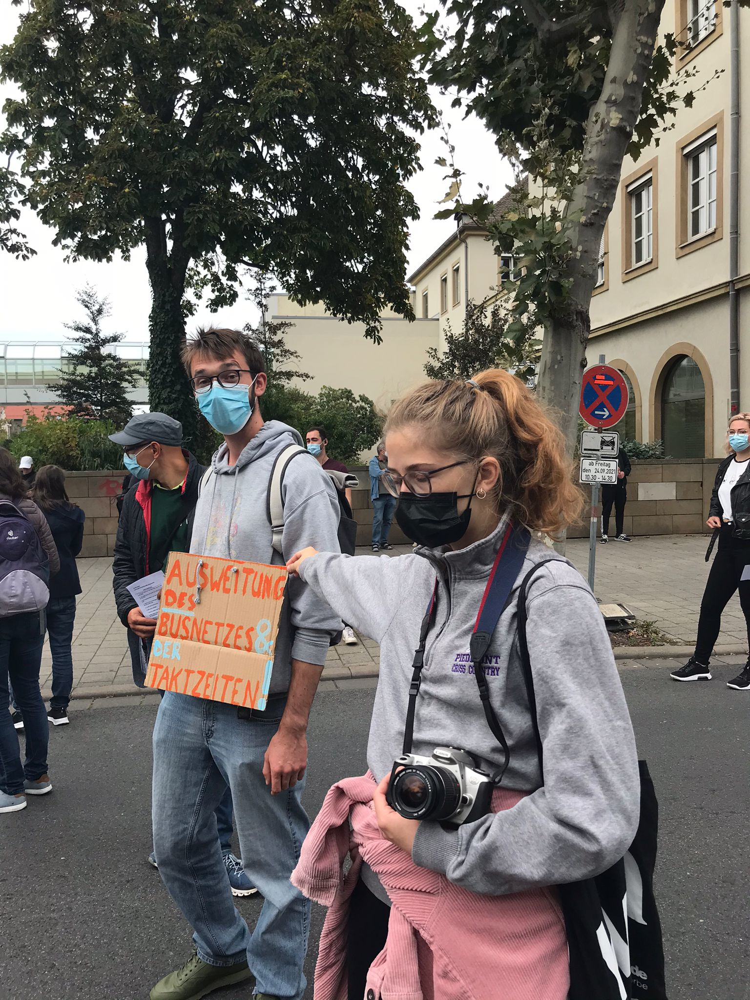

Du stehst vorm Friseur in Bamberg - ein Ort, den Leo niemals frequentieren würde.
Die Haare kann er sich nämlich auch gut genug selbst schneiden.

W�hrend deine Ruhe genießt, siehst du eine kleine Demo vorbeiziehen.
Und mittendrin - steht auch Leo. Er protestiert nun für... Taktzeiten? 

Warum ist ihm das denn gerade wichtig? Kann er sich nicht einfach zu seiner Party begeben?

Du säufzst ein letztes Mal und machst dich wieder auf dem Weg hinterher.
Jedoch kannst du ihn nicht mehr im Demozug ausfindig machen.
Sein Interesse ist wohl schnell wieder verfolgen und ihn hat die Lust nach was Neuem gepackt.
Du vermutest, dass ihm mittlerweile der Sinn nach körperlicher Ertüchtigung steht.
Wu suchst du ihn also?

<a href="/leonardkestel/stangenpark">
<button>Im Stangenpark</button>
</a>
<a href="/leonardkestel/baumhaus">
<button>auf einem Baum</button>
</a>