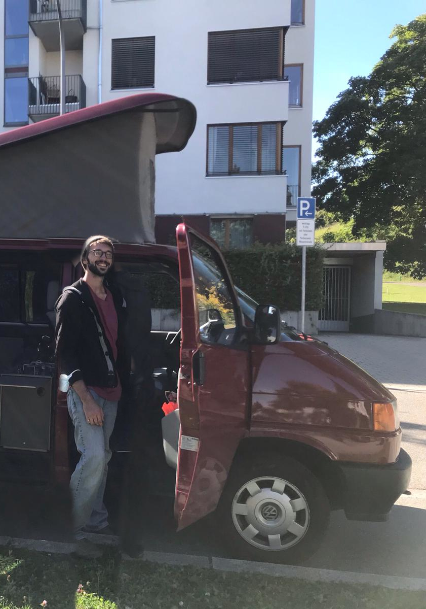
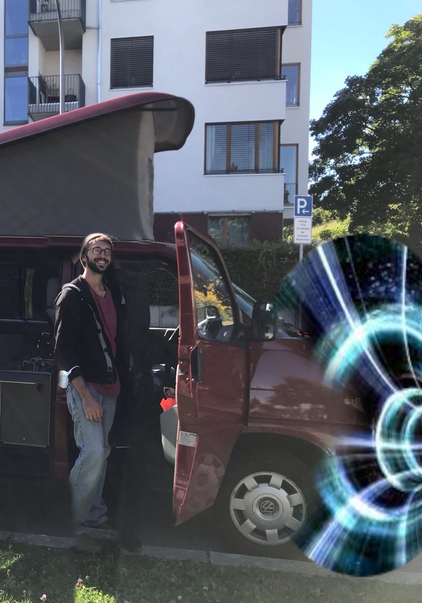

Etwas gelangweilt stehst du auf dem Parkplatz.

Heute Abend steht das Event des Jahres an: Leonard Kestel feiert in seinen Namenstag rein.
Aus ganz Deutschland sind seine Freunde zusammengekommen, um diesen Anlass zu feiern.
Gäste, Getränke, Geschenke, alles ist bereits in Position. Nur der Gastgeber fehlt noch.
Er will dir nämlich unbedingt seine neueste Erfindung zeigen. Keine Ahnung, was er jetzt schon wieder vorhat.

Leo kommt mit einer absoluten Klapperkiste von Bus angefahren. Verschmitzt grinst er dir aus dem Fenster zu.

"Vinz' Penismobil kenne ich doch schon.", rufst du ihm zu.

"Es gehärt nicht Vinz! Im Moment noch gehärt es uns beiden zu 25%, bis ich ihm in 3 Jahren eventuelle weitere 25% -"

"Jaja ist mir egal. Aber was soll nun daran neu sein?"

Leo holt aus: "Ich hab den Bus umgebaut. Man kann damit nun nicht nur zu irgendwelchen uninteresanten Campingplätzen fahren,
sondern auch durch RAUM und ZEIT reisen!"

"Hä was?"

"Und genau das werde ich nun tun. Um etwas zu erledigen. Meine Party braucht das. Es ist notwendig."

Bevor du begreifen kannst, was fär einen Quatsch Leo nun schon wieder von sich gibt, fährt er durch ein Wurmloch und ist verschwunden.

Es liegt nun an dir, ihn wieder einzufangen und rechtzeitig zur Party zu bringen. Nimmst du die Mähe auf dich?

<a href="/leonardkestelistweg.github.io/vinzmotorrad">
<button>Hopp lass ihn suchen</button>
</a>
<a href="/leonardkestelistweg.github.io/partyohneleo">
<button>scheiß drauf wir feiern ohne ihn</button>
</a>