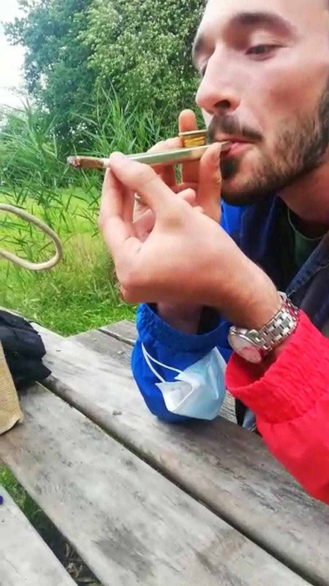

Du stolpert durch den Wald, schaust dich um, doch kannst ihn einfach nicht ausfindig machen.
Bis du ein befriedigtes Grunzen hörst.

Leo hockt über dem Waldboden und verrichtet sein Geschäft.

Nachdem du ihn entgeistert anschaust, setzt er zu einer durchwachsenen Rechtfertigung an.
"Das ist total gesund für den Körper und auch gut für den Wald und -"

Es interessiert dich nicht. "Schnell weg hier, Vinz" - Du willst erstmal deine Ruhe vor Leo.

An welchem Ort würdest du ihn am wenigsten erwarten?

<a href="/leonardkestelistweg.github.io/friseur">
<button>Friseur</button>
</a>
<a href="/leonardkestelistweg.github.io/paula">
<button>Pünktlich im Labor zu seinem Experiment-Termin mit Paula</button>
</a>